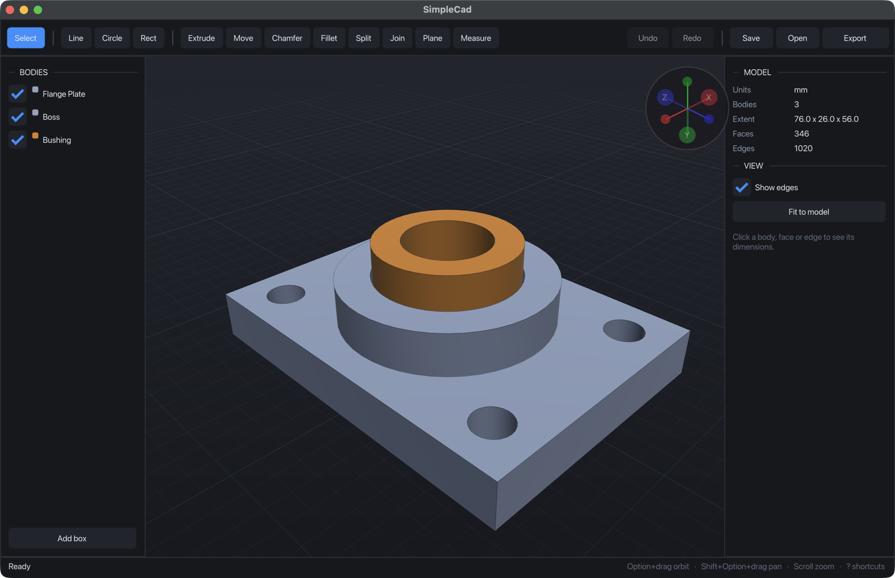

# SimpleCad

A small, from-scratch CAD application in C++. Sketch a profile, extrude it, cut
holes, chamfer edges, export STL. No cloud, no accounts, no plugin system — a
single ~3 MB binary that opens instantly.



Two external dependencies (GLFW and Dear ImGui, both fetched by CMake). The
geometry kernel, renderer and UI are all in this repo.

> **Expectation setting:** this is a working hobby modeller, not a Fusion 360
> replacement. It does direct modelling well enough to make real parts, but it
> has **no feature history** — you cannot go back and change an extrude after
> the fact — and its kernel represents everything as flat polygons. Read
> [Status](#status) before deciding whether it fits what you need.

---

## Build and run

Requires CMake 3.20+ and a C++17 compiler. Tested on macOS; the code is written
to be portable but Windows and Linux are currently unverified.

```bash
cmake -B build
cmake --build build -j 8

./build/simplecad                 # empty document
./build/simplecad showcase.scad   # open a file directly

# Export without opening a window
./build/simplecad showcase.scad --export-stl part.stl

# Run the kernel tests
./build/kernel_tests
```

`showcase.scad` is the model in the screenshot above.

---

## Controls

Navigation is designed for a laptop trackpad first — nothing requires a button a
trackpad lacks, or a key a compact keyboard omits.

| Action | Trackpad | Mouse |
| --- | --- | --- |
| Orbit | Option + drag | Right-drag or middle-drag |
| Pan | Shift + Option + drag, or Shift + scroll | Shift + right/middle-drag |
| Zoom | Two-finger scroll / pinch (anchored to the cursor) | Wheel |
| Fit view | `F` | `F` or `Home` |
| Hide panels | `Tab` | `Tab` |
| All shortcuts | `?` | `?` |

Tools: `L` line, `C` circle, `R` rectangle, `E` extrude, `G` move, `M` measure,
`Shift+C` chamfer, `Shift+F` fillet, `Shift+S` split, `T` trim, `O` offset,
`Esc` back to select. Every tool is also on the toolbar.

---

## Cutting a part in two

The one workflow worth spelling out, because it uses four tools together:

1. **Plane** — click a face to drop a construction plane on it, then drag the
   arrow (or type an offset in the panel) to slide it along its own normal to
   where you want the cut.
2. **Split** — click the body, then click the plane. You now have two bodies.
3. **Move** — click a body and drag one of the X / Y / Z arrows to pull the
   halves apart, or type an exact distance per axis.
4. **Join** — click two or more bodies to add them to the selection, then press
   `Enter` or the Join button to fuse them back into one.

Split is exact — the two halves are watertight and their volumes sum to the
original. Move preserves volume and carries bores with it. Join is a real
boolean union, so overlapping halves merge rather than simply stacking.

## Status

### Works

**Sketching** — on any planar face, the origin planes, or a construction plane.
Line, circle and rectangle, with magnetic snapping to face corners, edge
midpoints, edges, centres, the grid and the origin. Trim and offset.

**Extrude** — new body, join, cut or intersect; one side, symmetric or two
sides. Push/pull a face directly, including faces that already have bores in
them; the bore is preserved through repeated extrudes.

**Booleans** — union, difference and intersection, verified against analytic
volumes (a 10 mm cube minus a Ø6 bore: 720.475 mm³ against an expected
720.475).

**Chamfer and fillet** — dimensionally correct on straight edges: a 1 mm chamfer
on a 10 mm cube edge removes exactly 5.000 mm³. Also works on a **hole rim** —
hovering any facet of a bore highlights and selects the whole circle, and the
chamfer or round is applied around the entire ring, watertight.

**Join** — select any number of bodies and confirm; they merge through the same
verified boolean union.

**Split** — cutting a body by a plane is exact: the two halves are watertight
and their volumes sum to the original at every plane tested.

**Move** — drag selected bodies along X, Y or Z with a screen-space gizmo, or
nudge them by an exact amount. Works on several bodies at once and carries
inner loops, so a bored part keeps its holes.

**Construction planes** — attach one to a face, slide it along its normal by
dragging or by typing an offset, sketch on it, or use it as a cutting plane.

**Measure** — distance between two points.

**Files** — save/load projects (the format carries hole loops and still reads
older files). Binary STL export, from the UI or headlessly with
`--export-stl`. A single body exports watertight and manifold, including parts
with many bores; a multi-body export is several shells in one file, which is
normal for STL.

**Tests** — `./build/kernel_tests` runs 65 invariant checks over the kernel:
analytic volumes for every boolean, watertightness, orientation, chamfer and
fillet sizes, split exactness, snapping priority and more. Most bugs in this
kernel were silent rather than loud, so the suite checks answers, not crashes.

**Interface** — undo/redo (100 steps), multi-body tree with per-body colour,
rename and visibility, selection-aware properties panel showing face area, edge
length and body extents, view cube, adaptive grid, smooth shading with feature
edges.

### Not implemented

- **No feature history.** The document is finished geometry, not a recipe. You
  cannot select a previous extrude and change 10 mm to 12 mm — only undo back
  through everything since. This is the single biggest gap against commercial
  CAD, and it is architectural rather than a missing button.
- **No sketch constraints or dimensions.** Snapping infers alignment while you
  draw, but nothing is *constrained* afterwards — a line drawn horizontal is
  just a line that happened to land there.
- **Only one sketch at a time.** Sketches are not persistent, re-editable
  objects; once consumed they stop existing.
- **No true curved surfaces.** A circle becomes a polygon when you draw it and
  stays one. Tessellation error is baked in at creation, and STEP/IGES export is
  therefore impossible in principle. Shading uses averaged normals with a crease
  angle, so curves *look* smooth.
- **No arcs.** `Sketch::addArc` exists in the kernel but is not reachable from
  the UI.
- **No shell.** It existed but produced a slab rather than a hollow body and
  was non-manifold; a correct version needs a real surface-offset that
  re-intersects adjacent planes, so it was removed rather than left in.
- **No pattern.** Removed for the same reason — it was reachable only by an
  undocumented shortcut and did not transform hole loops.
- **No assemblies, joints, revolve, sweep, loft, or draft.**

### Known defects

| Issue | Effect |
| --- | --- |
| Booleans can leave T-junctions | BSP splitting can leave a vertex sitting on a neighbouring triangle's edge. Volumes stay exact and the solid stays closed, so slicers handle it, but the mesh is not strictly manifold after several cuts. |
| Chamfering edges that meet at a corner | Each edge trims its own two faces and nothing blends the wedge where three meet, so chamfering *every* edge of a box leaves T-junctions at the eight corners. One edge, or several that do not share a corner, is exact and watertight. |
| No feature history | See below — the largest gap, and architectural. |
| Per-frame GPU upload | Tessellation is cached, but meshes re-upload every frame and the viewport redraws continuously. Fine at these model sizes; will not scale. |

Fixed since the first review, each with a test guarding it: chamfer and fillet
doing nothing useful on a hole rim (and destroying the surrounding face);
`offsetProfile2D` collapsing any profile it touched; curved edges not selecting
as one edge; parts with holes exporting solid; `csgSubtract` returning the intersection; `extrude` producing
inside-out solids; chamfer and fillet removing 13–30× too much material; split
producing inverted caps away from the origin; booleans shredding one face into
hundreds of fragments; edge welding breaking outside a ±50 mm box; the viewport
going blank when sketching on the top plane; and sketch snapping never engaging.

---

## How it works

```
Dear ImGui UI      toolbar, panels, status bar, overlays
OpenGL 3.3         shaded solids, feature edges, grid, selection
App logic          tool state machine, undo stack, selection, snapping
Geometry kernel    faces, edges, solids; extrude, chamfer, fillet, booleans
```

Solids are boundary representations built from planar polygonal faces. Each face
carries an outer loop and any number of inner loops (holes). Curved surfaces are
approximated by many flat faces; booleans use a BSP tree.

`src/` layout: `geometry.*` (kernel), `csg.cpp` (booleans), `sketch.*` (2D and
snapping), `renderer.*` (OpenGL), `picking.cpp`, `extrude.cpp`,
`tool_edge_modifier.cpp` (chamfer/fillet), `ui.cpp`, `theme.cpp`, `scene.cpp`,
`input.cpp`, `save_load.cpp`, `undo.cpp`, `tool_move.cpp`. Tests live in
`tests/kernel_tests.cpp`.

---

## Licence

No licence has been chosen yet, so default copyright applies. Open an issue if
you want to use this for anything.
